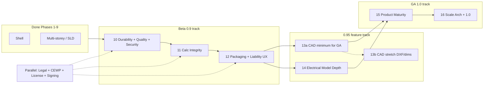
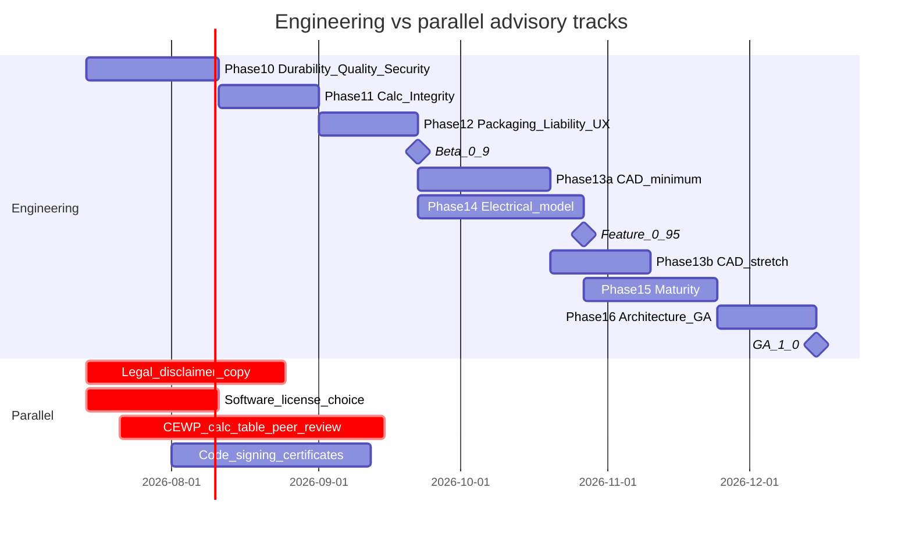
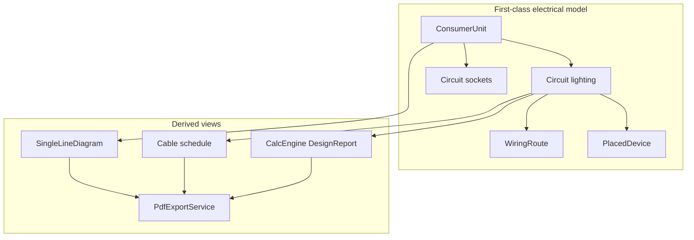
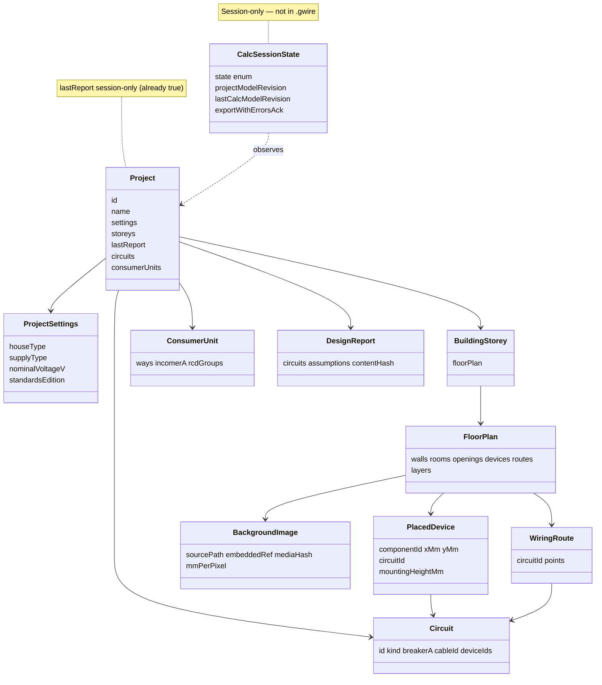
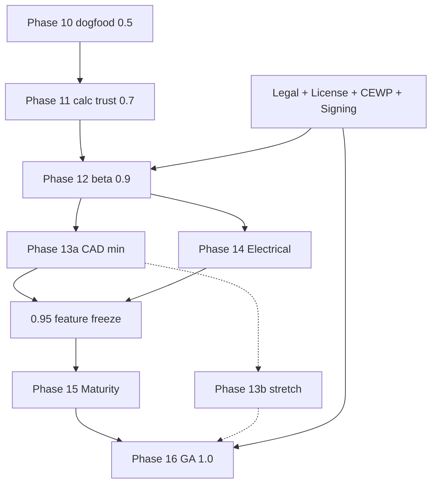

# GhanaWire AI — Production Roadmap (Phases 10–16)

| Field | Value |
|-------|-------|
| **Product** | GhanaWire AI (G-Wire Designer) |
| **Repo** | `/home/drapiigi/Projects/EDesignTool` |
| **Current version** | `0.1.0-SNAPSHOT` (`GWireApp.APP_VERSION`, `pom.xml`) |
| **Completed** | Phases 1–9 (shell → multi-storey / wiring / SLD / packaging scripts) |
| **`.gwire` format** | `1.1` (`ProjectStore.FORMAT_VERSION`); bundled sample resource still **`1.0`** |
| **Stack** | Java 21, JavaFX 23, Maven, H2 (`~/.gwire/library`), PDFBox, POI, Jackson |
| **Audience** | Senior engineers implementing production readiness toward beta **0.9** and GA **1.0** |
| **Doc status** | Design — implementable program after Phase 9 (**rev 3** — residual re-review nits closed) |
| **Revision** | 2026-07-14 rev 3 — close/Save-As + Don’t-save autosave cleanup; always write formatVersion 1.2 after package lands; session-only modelRevision; SecretStore P0 = 0600 plaintext OK |

---

## Overview

Phases 1–9 delivered a working Ghana residential electrical design desktop app: floor-plan CAD-ish canvas, H2 symbol library (**~50 starter catalogue components** via `ComponentSeed.starterCatalogue()`; `ComponentRepositoryTest` asserts `count() >= 40`), load/diversity/cable calc with L.I. 2008 practice checks, optional LLM/vision, save/load, PDF/Excel export, sample house, multi-storey, wiring routes, and SLD.

Consultant assessment against AutoCAD / professional electrical tools identifies **P0 ship blockers** (liability UX, installers, file durability, calc integrity, security, quality), then **P1 CAD feel**, **P1 electrical model depth** (competitive moat), **P2 product maturity**, and **P3 scale architecture**.

This document turns that assessment into **Phases 10–16**: a concrete delivery program with package-level touch points, effort, risks, agent orchestration, release gates, and a detailed Phase 10 PR plan.

**Strategic principle:** Ship **trustworthy preliminary design software** for CEWPs and trainees — not a full AutoCAD clone, not 3D BIM, not industrial plant design.

### Official critical path (post-review)

After **beta 0.9** (Phase 12), **Phase 13a (CAD minimum)** and **Phase 14 (electrical model)** may run **in parallel** with two engineers (canvas vs domain/calc/panels). Single-engineer staffing runs them serially (13a then 14). Phase **13b** (DXF, full dimensions, grips stretch) is post-0.95 / GA-stretch and does not block the electrical track.



---

## Background & Motivation

### Current architecture (grounded)

```
com.ghana.gwire
├── Main / GWireApp                 # JavaFX entry; version 0.1.0-SNAPSHOT
├── ui/                             # MainWindow, AppMenuBar, FloorPlanCanvas, panels
├── domain/
│   ├── floorplan/                  # FloorPlan, Wall, Room, Opening, WiringRoute, BackgroundImage
│   ├── project/                    # Project, BuildingStorey, ProjectSettings
│   ├── components/                 # ElectricalComponent, PlacedDevice
│   ├── calc/                       # CircuitLoad, DesignReport, ValidationIssue
│   └── geometry/                   # Vec2, Segment2
├── service/
│   ├── calc/                       # CalcEngine, CircuitBuilder, Diversity*, Cable*, StandardsValidator
│   ├── persist/                    # ProjectStore (.gwire JSON)
│   ├── export/                     # PdfExportService, BoqExcelExportService
│   ├── history/                    # FloorPlanHistory (deep-copy undo, MAX=50)
│   ├── wiring/, sld/, importing/
├── db/                             # H2 ComponentLibraryService @ ~/.gwire/library
└── ai/                             # AiSettings (~/.gwire/ai.properties plaintext), vision
```

| Capability | Implementation snapshot | Gap vs production |
|------------|-------------------------|-------------------|
| Save/load | `ProjectStore.save` uses `MAPPER.writeValue(path.toFile(), root)` — **direct overwrite, no atomic write** | Truncation risk; no autosave, recovery, embed images |
| Dirty state | `MainWindow.dirty` + title `*`; `confirmDiscardIfDirty` is Yes discard / No cancel (**no Save**) | **No `stage.setOnCloseRequest`** — window close can drop dirty work; `GWireApp.stop()` only shuts H2 |
| Sample file | `samples/ghana-3bed-house.gwire` is still **formatVersion `1.0`** (no `storeys` array) | Must keep load path; regenerate to 1.1+ in packaging polish |
| Calc | `CalcEngine` → `DesignReport` on `Project.lastReport` | Unit tests exist; no golden files; formulas undoc’d |
| Stale calc | `onModelChanged` nulls `lastReport`; **not persisted** on save/load | After open, `lastReport` always null; PDF export **auto-recalcs** silently — “stale” vs “never calc” indistinguishable |
| Security | `AiSettings` plaintext `~/.gwire/ai.properties`; `maskedKey()` OK | World-readable secrets file; console-only logback |
| Packaging | `scripts/package-*.sh|ps1`, `docs/PACKAGING.md` | Unsigned; no MSI/deb CI; no update check; no `.github/workflows` |
| Liability | Panel/PDF disclaimers (short strings) | No first-run acceptance, standards edition stamp workflow |
| Undo | Single `FloorPlanHistory` deep-copy stack (MAX=50) | **Storey switch does not clear history** — undo can apply wrong storey snapshot onto active floor; no command stack |
| Circuits | Ephemeral `CircuitLoad` with **`UUID.randomUUID()`** each build | `WiringRoute.circuitId` can dangle; not first-class editable objects |
| Hit-test | `FloorPlan.hitDevice` / `hitWall` are **O(n)** linear scans | Redraw-all each frame is the larger cost; not O(n²) today |
| Background | `BackgroundImage.sourcePath` is **final**; path-only; `copy()` path metadata only | No embed; open fails if original path missing |
| Catalogue | ~**50** seed components (`ComponentSeed`) | Docs historically said “~73” — incorrect |

### Why now

Without Phases 10–12, distributing to non-developer CEWPs risks data loss, silent wrong calc exports, secret leakage, and liability exposure. Phases 13a–14 are the competitive moat vs generic CAD + spreadsheet workflows. Phases 15–16 mature the product for 1.0.

---

## Goals & Non-Goals

### Goals

1. **Trustworthy files** — atomic save, autosave, crash recovery, backups, format migration tests, optional `.gwirez` packages with embedded rasters.
2. **Trustworthy calculations** — golden tests (normalized), formula documentation, assumption flags, explicit calc freshness + export gates.
3. **Ship to installers** — jpackage app-image **required** for beta; deb/MSI best-effort with toolchain notes; update check; signing hooks.
4. **Security defaults** — offline-first AI, secrets not world-readable plaintext, no client design data in logs.
5. **CAD usability (GA minimum)** — hybrid/command undo, ortho, endpoint OSNAP, architecture/electrical layers, plot scale; stretch: grips, dims, DXF.
6. **Electrical depth** — circuits as model objects, CU/board editor, cable schedule, SLD from same model, mounting heights, validation checklist workflow.
7. **GA architecture** — domain split, CI packaging, semver 1.0, spatial index for large plans.

### Non-Goals

| Non-goal | Rationale |
|----------|-----------|
| Full AutoCAD clone | Cost / focus; subset is enough for household wiring |
| 3D BIM first | 2D plan + SLD is the Ghana residential workflow |
| Industrial plant / HV design | Residential L.I. 2008 first |
| Cloud collaboration / multi-user | Desktop local-first through 1.0 |
| Real-time multiplayer CAD | Out of scope |
| Replacing CEWP professional judgment | Product is preliminary design aid only |
| OS keyring (libsecret/CredMan) as P0 | P0 is local secrets file mode **0600** (key text OK; no crypto required); keyring / real encryption is Phase 15+ optional |

---

## Mapping: Consultant Priorities → Phases

| Consultant priority | Items | Phase(s) | Parallel track? |
|---------------------|-------|----------|-----------------|
| **P0** Legal/liability | Disclaimers, standards edition stamp, CEWP peer review of tables | **12** (UX + stamp) + parallel CEWP/legal | **Yes** |
| **P0** Installers | App-image required; MSI/deb best-effort; bundled JRE; update check | **12** | Signing certs parallel |
| **P0** File durability | Atomic save, autosave, recovery, backup; package 1.2 | **10** (package may be 10.2b if schedule slips) | No |
| **P0** Calculation integrity | Golden tests, formula docs, stale/export gates, assumption flags | **11** | CEWP review of golden expectations |
| **P0** Security | Local secrets store, no client data logs, offline default | **10** | No |
| **P0** Quality | Global exception handler, **service** smoke, large-plan redraw | **10** | No |
| **P1** CAD professional feel | 13a GA min; 13b DXF/dims/grips stretch | **13a / 13b** | Parallel with 14 if 2 eng |
| **P1** Electrical model depth | Circuits, CU editor, cable schedule, SLD, heights, checklist | **14** | Parallel with 13a if 2 eng |
| **P2** Product maturity | Scale cal, templates, CLI prompts, price book, AI diffs, manuals, telemetry | **15** | Telemetry legal optional |
| **P3** Scale architecture | Domain split, CI packaging, semver 1.0, spatial index | **16** | No |

### Parallel tracks (do not block engineering)



> **Gantt scheduling note:** Mermaid ties `Feature_0_95` / `Phase15` to `after p14` for layout only. **Official rule:** **0.95 freeze and Phase 15 start = max(end of 13a, end of 14)**. If 13a slips past 14, hold 0.95 / Phase 15 until 13a completes (and vice versa). Overview and Rollout diagrams already show both edges into Phase 15.

| Track | Owner | Starts with | Unblocks |
|-------|-------|-------------|----------|
| **Legal disclaimer / EULA copy** | Counsel or founder draft → counsel | Day 0 of Phase 10 | Phase 12 final dialog text; GA release notes |
| **Software license** (proprietary vs OSS) | Founder / counsel | Day 0 of Phase 10 | Beta 0.9 ships `LICENSE` or “proprietary beta — all rights reserved” |
| **CEWP peer review of load/diversity/cable tables** | Licensed CEWP | Mid Phase 10 / start Phase 11 | Golden “approved” baselines; GA claims |
| **Code signing certs** | Org IT | Phase 11 | Signed MSI/deb (optional for beta) |

**Phases 10–12 are implementable immediately** using draft/placeholder legal strings (already present in `CalcResultsPanel`, `PdfExportService`, `StandardsValidator` Javadoc). Final counsel-approved copy is a **swap**, not a redesign.

---

## Overall Program Timeline

| Milestone | Version | Target window (1–2 eng) | Entry criteria | Exit criteria |
|-----------|---------|-------------------------|----------------|---------------|
| **Start production program** | 0.1.x | Now | Phase 9 done | Phase 10 started |
| **Internal dogfood** | 0.5.0 | End Phase 10 core (~3–4 eng-weeks) | Atomic save + backup + autosave/recovery + **window-close Save/Don’t/Cancel** + exception handler + secret hygiene | Daily use without data-loss bugs |
| **Calc-trusted build** | 0.7.0 | End Phase 11 (~+3 w) | Golden suite green | Formula doc; export state machine on |
| **Public beta** | **0.9.0** | End Phase 12 (~+3 w; **~10–11 w** total) | App-image installers + liability UX + beta gates | External CEWPs install without Maven |
| **Feature beta+** | **0.95.x** | End Phase 13a+14 (parallel ~5 w with 2 eng; serial ~9 w) | 0.95 gates | Circuits first-class; CAD minimum |
| **GA** | **1.0.0** | End Phase 16 (~+7 w; **~22–28 eng-weeks** wall-clock with 2 eng parallel 13a∥14 ≈ **5–7 months**) | Domain split, CI packages, CEWP tables, license | Semver 1.0 |

**Effort rollup (1–2 engineers):**

| Phase | Effort | Cumulative (serial worst case) | Notes |
|-------|--------|--------------------------------|-------|
| 10 | **L — 4 eng-weeks** | 4 | Dogfood gate ~3 w; package 1.2 may finish as 10.2b |
| 11 | M–L — 2.5–3 eng-weeks | 7 |
| 12 | L — 3 eng-weeks | 10 |
| **13a** | **M–L — 3–4 eng-weeks** | 14 (if serial after 12) | GA CAD minimum |
| **14** | L — 4–5 eng-weeks | 19 serial / **~15 parallel** with 13a | Format 1.3 |
| **13b** | M — 2–3 eng-weeks | optional / stretch | DXF, full dims, grips polish |
| 15 | M–L — 3–4 eng-weeks | +4 |
| 16 | M — 2–3 eng-weeks | **~22–24** (2 eng) / **~26–28** (1 eng serial) |

**KD-14 (sequencing):** With two engineers after beta, schedule **13a ∥ 14**, then 15 → 16. With one engineer: **13a → 14 → 15 → 16**; 13b anytime after 13a without blocking 14.

---

## Locked contracts (implementer-facing)

### KD-13 / Format 1.2 — Project package layout (closes former Open Question #1)

| Rule | Specification |
|------|----------------|
| **Default save** | Remains **`.gwire`** — pretty-printed JSON via `ProjectStore` (formatVersion field). |
| **Save as package** | Optional **File → Save as package…** writes **`.gwirez`** (ZIP). |
| **ZIP layout** | `project.json` (same schema as `.gwire`) + `media/{sha256-or-id}.{ext}` for each embedded storey background. |
| **formatVersion (write policy)** | **After PR-10.2 merges:** always write **`1.2`** for every new save (`.gwire` and `.gwirez`), even when no media is embedded — keeps `ProjectStore.FORMAT_VERSION` single-valued and avoids dual fixtures. **Until PR-10.2 lands:** dogfood PRs may keep writing **`1.1`** (current constant). Loaders already accept any `1.*`. Document in `docs/persist/FORMAT.md`. |
| **JSON keys per background** | Keep `sourcePath` (cache path after load, or original path if not embedded). Add optional: `embeddedRef` (string id matching `media/{embeddedRef}` entry), `mediaHash` (hex sha256 of bytes), `sourceLabel`, transforms unchanged. **No base64 in production project files** — base64 only allowed in unit-test fixtures under a few KB. |
| **Multi-storey** | Each `storeys[i].floorPlan.background` independently embeds; package includes all media entries referenced. Active storey snapshot `floorPlan` stays backward-compatible. |
| **Load** | Accept `.gwire` and `.gwirez`. For package: extract media to `~/.gwire/cache/media/{mediaHash-or-ref}` if missing; construct `BackgroundImage` with **cache path** as `sourcePath` + preserve `embeddedRef` on domain (see BackgroundImage changes). |
| **Chooser** | Open: `*.gwire`, `*.gwirez`. Save: default `.gwire`; package action forces `.gwirez`. |

### Calc freshness state machine (Phase 11)

`lastReport` is **session-only** (not persisted — keep that). Add UI/engine state on `MainWindow` (or thin `CalcSessionState`):

| State | Meaning | How entered |
|-------|---------|-------------|
| **`NONE`** | Project opened/created; user has not successfully calculated this session | After load / new / sample; `lastReport == null` and never calc’d |
| **`FRESH`** | `lastReport` matches current model revision | After Tools → Recalculate (or gated export auto-recalc that user accepted) |
| **`DIRTY_CLEARED`** | Model changed since last report; report cleared | `onModelChanged` nulls report → state `DIRTY_CLEARED` if previously `FRESH`/`ERRORS_PRESENT`, else stay `NONE` |
| **`ERRORS_PRESENT`** | Fresh report exists and `DesignReport.hasErrors()` | After calc with ERROR severity issues |

Optional fields (recommended) — **session-only**, not written to `.gwire`:

| Field | Lives on | Persisted? |
|-------|----------|------------|
| `projectModelRevision` (long, ++ on model-changing edits) | `MainWindow` / `CalcSessionState` (or non-serialized runtime field on `Project` cleared on load) | **No** |
| `lastCalcModelRevision` | Same session state | **No** |
| `DesignReport.contentHash` | Report instance (session) | **No** (recalc regenerates) |
| `exportWithErrorsAcknowledged` | Session state; cleared when leaving `ERRORS_PRESENT` | **No** |

Do **not** add `modelRevision` to the on-disk format schema. If a long is kept on `Project` for convenience, mark it `transient` / omit from `ProjectStore` write/read.

**Export gates:**

| State | PDF | Excel (devices) | Excel (cables) |
|-------|-----|-----------------|----------------|
| **NONE** | Auto-recalc allowed **with** status “Calculated at export {timestamp}” stamp; or prompt Recalculate first (product default: **auto-recalc + stamp**) | OK without cables | Requires calc (auto or prompt) |
| **DIRTY_CLEARED** | Modal: “Calculations outdated — recalculate?” **default Yes** | Same | Same |
| **FRESH** | Export freely | OK | OK |
| **ERRORS_PRESENT** | Require checkbox **“Export with validation errors”**; stamp ERROR count on cover | OK | Cable sheet allowed but rows flagged; or block cable sheet until ack |

`calculatedAt` alone is **insufficient** (not persisted; always “now” after calc). Gates use the state enum + revision counters.

### Golden harness contract (Phase 11)

| Rule | Detail |
|------|--------|
| **Inputs** | Committed fixtures under `src/test/resources/goldens/input/*.gwire` (+ factory-built projects in code). Use **seed catalogue** (`ComponentSeed.starterCatalogue()`), never live `~/.gwire/library`. |
| **Outputs** | `src/test/resources/goldens/expected/*.json` — **normalized** `DesignReport` DTO only. |
| **Strip** | Circuit UUIDs, `calculatedAt`, any wall-clock fields, device-order-sensitive noise. |
| **Sort** | Circuits by `(kind, name, connectedLoadW)` then device-id multiset hash; issues by `(severity, code, message)`; assumptions sorted unique. |
| **Assert** | Totals (W, A, max Vd%); per-circuit kind/name/I/CSA/breaker/Vd%; issue **codes** multiset; assumption codes. |
| **IDs** | Must **not** depend on Phase 14 persistent `Circuit.id`. Ephemeral UUIDs from `CircuitLoad` are ignored. |

### AtomicFileWriter algorithm (Phase 10)

```
1. Write full payload to `{path}.tmp` (or `{path}.gwire.tmp`) via FileChannel / buffered stream
2. FileChannel.force(true) on the temp file (fsync data+metadata best-effort)
3. Files.move(tmp, path, REPLACE_EXISTING, ATOMIC_MOVE)
4. On AtomicMoveNotSupportedException: Files.move(tmp, path, REPLACE_EXISTING)  // non-atomic but still write-then-replace
5. Never MAPPER.writeValue directly onto the primary path (current bug)
6. On failure mid-write: leave primary untouched; delete tmp in finally if move failed
```

Backup rotation **before** replace: `path.bak2` ← `path.bak` ← copy of existing `path` (if exists).

### SecretStore P0 bar (not “OS keychain”)

Threat model for P0 is **other local users / world-readable home files**, not a hostile co-user with same UID. Do not over-engineer KDF/AES for dogfood.

| Priority | Behavior |
|----------|----------|
| 1 | Env vars (`GWIRE_AI_API_KEY`, etc.) — highest, never written back |
| 2 | **`~/.gwire/secrets` (or `secrets.properties`) mode `0600`** holding the API key as plain text (or trivial obfuscation). **Real AES-GCM / KDF not required for P0.** |
| 3 | One-time migrate from `~/.gwire/ai.properties` `apiKey=` into secrets file; strip key from properties; leave non-secret props in place |
| **Not P0** | libsecret / Windows Credential Manager / macOS Keychain; “proper” encryption-at-rest — optional Phase **15+** |
| **UI copy** | “Stored in local secrets store” — **not** “OS keychain” / “encrypted vault” until those land |
| Always | Never log raw key; `maskedKey()` only; project geometry not at INFO |

### Embedded background load/save sequence

```mermaid
sequenceDiagram
  participant User
  participant MW as MainWindow
  participant PP as ProjectPackage
  participant Disk
  participant Cache as ~/.gwire/cache/media
  User->>MW: Save as package (.gwirez)
  MW->>PP: collect storeys backgrounds
  loop each background with readable sourcePath
    PP->>Disk: read bytes, sha256
    PP->>Disk: zip media/{ref}.ext
    PP->>PP: set embeddedRef + mediaHash on JSON node
  end
  PP->>Disk: zip project.json + media/*
  User->>MW: Open package (later; original path gone)
  MW->>PP: unzip
  PP->>Cache: write media if hash missing
  PP->>MW: BackgroundImage(cachePath, label, mmPerPixel) + embeddedRef
  Note over MW: FloorPlanWorkspace.reloadBackgroundRaster uses cache path file
```

| Rule | Detail |
|------|--------|
| Domain long-term | Prefer path + `embeddedRef`/`mediaHash` on `BackgroundImage` (extend type; `sourcePath` need not stay sole identity). **No long-lived `byte[]` on domain.** |
| Import pipeline | May hold bytes temporarily while writing cache/package. |
| Undo / `copy()` | Copies path + embed metadata; bytes remain in cache by hash. |
| Recovery / missing cache | If `embeddedRef` set but cache file missing and not inside open package stream — prompt re-open package or “background missing”. |
| Test | Save package → delete original PNG path → open `.gwirez` → raster visible. |

### Multi-storey history (Phase 10 / 13a)

| Phase | Requirement |
|-------|-------------|
| **10 (must)** | On storey switch (`FloorPlanWorkspace.switchStorey` / storey bar): **`history.clear()`** so undo cannot apply another storey’s snapshot. Document as known limitation until command stack. |
| **10 autosave** | Always serialize **full `Project`** (all storeys). Recovery tests use **2-storey fixture**. |
| **13a** | Command stack is **project-scoped**: each command records `storeyId` (or storey index) and mutates that storey’s plan only. |

---

## Proposed Design — Phased Delivery

### Phase 10 — Production Hardening: Durability, Quality & Security

| | |
|--|--|
| **Name** | Production Hardening (Durability · Quality · Security) |
| **Goal** | Make the app safe for daily professional use: never lose work on crash **or normal quit**, never crash silently, never leak secrets, stay offline-first. |
| **Dependencies** | Phase 9 complete (format 1.1, multi-storey). None on legal counsel. |
| **Effort** | **L — ~4 eng-weeks** (1–2 engineers). Dogfood gate achievable ~3 weeks if package PR slips. |
| **Risk** | **Medium** — format package is medium risk; isolate as deferrable 10.2b |

#### Success criteria

**Dogfood gate (blocks 0.5.0 / end-of-core Phase 10):**

1. **Atomic save** via `AtomicFileWriter` algorithm above (fsync + move; fallback if `ATOMIC_MOVE` unsupported).
2. Rolling backups `.bak` / `.bak2` beside project file on Save.
3. Autosave every N minutes (default 5) when dirty → `~/.gwire/autosave/{projectId}.gwire` (full multi-storey project).
4. Crash recovery dialog on next launch if autosave newer than clean-exit marker.
5. **Window close / quit:** `stage.setOnCloseRequest` → **Save / Don’t save / Cancel** with rules:
   - **Save** and `projectPath == null` (new project or sample from resource) → run **Save As** chooser first; if user cancels chooser, **abort close** (stay open, keep dirty).
   - **Save** with path set → atomic save to `projectPath`, then clean-exit path.
   - **Don’t save** → **delete** (or mark discarded) `~/.gwire/autosave/{projectId}.gwire` so next launch does **not** offer recovery for deliberately discarded work; then write **clean-exit marker**.
   - **Cancel** → consume close event; stay open.
   - **Crash recovery** only when: no clean-exit marker **and** autosave exists (and is newer than last known good if tracked).
   - Same three-button pattern replaces Yes/No-only `confirmDiscardIfDirty` for New/Open/Sample (Save with null path → Save As).
6. Uncaught exception handlers (default + FX) show dialog; no full project JSON in logs.
7. SecretStore P0 bar (**0600 secrets file**, encryption optional/not required; migrate off world-readable apiKey); never log raw key; offline AI messaging.
8. **Service-level smoke (required):** load sample (`SampleProjectFactory` or resource `.gwire`) → `CalcEngine.calculate` with seed catalogue → `PdfExportService.export` to temp. Always runs in CI (no display).
9. On storey switch: clear `FloorPlanHistory` (multi-storey undo hazard fix).
10. Canvas: **coalesce redraws**; skip **drawing** off-viewport devices when zoomed; bbox reject in pick (O(n) scans OK). Target interactive feel at ~500 devices / 200 walls on reference laptop.

**Phase 10 complete (may trail dogfood by ~1 week as 10.2b):**

11. **`.gwirez` package** per KD-13; after PR-10.2, **`ProjectStore.FORMAT_VERSION = "1.2"`** for all writes; load 1.0 / 1.1 / 1.2.
12. Migration tests include bundled sample **1.0** file and a multi-storey **1.1** fixture; optional embed round-trip.
13. TestFX UI smoke **optional** (`@EnabledIf` display available) — not a CI gate.

#### Scope

| In | Out |
|----|-----|
| Atomic save / autosave / recovery / backup / close prompts | Full encrypted project at rest |
| History clear on storey switch | Full project-scoped command undo (13a) |
| `.gwirez` package (can be 10.2b) | Cloud sync |
| Global exception handler + file logs | Full APM SaaS |
| **Service** smoke + redraw coalescing | TestFX required; spatial index (16) |
| SecretStore P0 (0600 file; crypto optional) | OS keyring / real encryption (15+) |
| | Legal EULA final copy |

#### Components / packages to touch

| Path | Change |
|------|--------|
| `service/persist/ProjectStore.java` | Use `AtomicFileWriter`; stop direct `writeValue` to primary path |
| `service/persist/` (new) | `AtomicFileWriter`, `AutosaveService`, `BackupService`, `ProjectPackage`, format notes |
| `domain/floorplan/BackgroundImage.java` | Add `embeddedRef`, `mediaHash` (nullable); factory/copy updates — path remains for raster load |
| `ui/MainWindow.java` | Autosave; recovery; **setOnCloseRequest**; three-button dirty; safer logging |
| `ui/canvas/FloorPlanWorkspace.java` | **clear history on storey switch** |
| `GWireApp.java` / `Main.java` | Uncaught handlers; recovery hook before show |
| `ai/AiSettings.java` + `service/security/SecretStore.java` | P0 secrets bar |
| `src/main/resources/logback.xml` | Rolling file under `~/.gwire/logs` |
| `ui/canvas/FloorPlanCanvas.java` | Redraw coalesce + view culling |
| `src/test/...` | Atomic, migration 1.0 sample, 2-storey autosave recovery, service smoke |
| `docs/` / `AGENTS.md` | Format 1.2 / `.gwirez` |

#### Suggested agent orchestration

| Slice | Role | Focus |
|-------|------|-------|
| 10A | Explorer | Call sites, background reload, history/storey |
| 10B | Implementer | AtomicFileWriter + backup (PR-10.1) |
| 10C | Implementer | Autosave + recovery + close/quit three-button (PR-10.3) |
| 10D | Implementer | SecretStore + logback (PR-10.5) |
| 10E | Implementer | Exception handler + history clear on storey switch (PR-10.4) |
| 10F | Implementer | Canvas redraw coalesce (PR-10.6) |
| 10G | Implementer | Service smoke (PR-10.7) |
| 10H | Implementer | ProjectPackage `.gwirez` (PR-10.2 / 10.2b) |
| 10I | Reviewer | 1.0/1.1 load; no key logging; close path |

```mermaid
sequenceDiagram
  participant User
  participant Stage
  participant MainWindow
  participant Autosave as AutosaveService
  participant Store as ProjectStore
  participant Disk
  User->>MainWindow: Edit geometry
  MainWindow->>MainWindow: dirty=true; lastReport=null; DIRTY or NONE
  Autosave->>MainWindow: Timer tick if dirty
  MainWindow->>Store: atomic save full Project to autosave/
  User->>Stage: Window close
  Stage->>MainWindow: onCloseRequest
  MainWindow->>User: Save / Don't save / Cancel
  alt Save and projectPath null
    MainWindow->>User: Save As chooser
    alt Chooser cancelled
      MainWindow->>Stage: abort close stay open
    else Path chosen
      MainWindow->>Store: backup + atomic save new path
      MainWindow->>Autosave: delete autosave entry optional; write clean-exit marker
    end
  else Save and projectPath set
    MainWindow->>Store: backup + atomic save projectPath
    MainWindow->>Autosave: write clean-exit marker
  else Don't save
    MainWindow->>Autosave: delete ~/.gwire/autosave/{projectId}.gwire
    MainWindow->>Autosave: write clean-exit marker
  else Cancel
    MainWindow->>Stage: consume event stay open
  end
```

---

### Phase 11 — Calculation Integrity & Trust

| | |
|--|--|
| **Name** | Calculation Integrity & Trust |
| **Goal** | Make every watt, amp, mm², and validation code reproducible, documented, and safe at export. |
| **Dependencies** | Phase 10 dogfood (stable fixtures). Package 1.2 nice-to-have. **Parallel:** CEWP peer review. |
| **Effort** | **M–L** — 2.5–3 eng-weeks |
| **Risk** | **Medium** — changing factors breaks goldens; CEWP may revise tables post-beta |

#### Success criteria

1. Golden suite per **Golden harness contract** (normalized JSON; seed catalogue; strip UUIDs/timestamps).
2. `docs/calc/FORMULAS.md` documents diversity, load assumptions, cable Vd, MCB selection.
3. Each `DesignReport` carries **sorted unique** assumption codes (table below).
4. **Calc freshness state machine** implemented; export gates as specified (NONE vs DIRTY_CLEARED vs ERRORS_PRESENT).
5. UI shows state: “Not calculated”, “Calculations outdated”, or “N errors — verify before install”.
6. Existing unit tests remain green; goldens additive.
7. If Phase 10 package slipped: optional PR to land 1.2 early in Phase 11 without blocking goldens.

#### Initial assumption-flag taxonomy

| Code | Source | When added |
|------|--------|------------|
| `LOAD_CATALOGUE_POWER_W` | `LoadTables` | Device used catalogue `powerW` |
| `SOCKET_ASSUMED_180W` | `LoadTables.SOCKET_13A_ASSUMED_W` | Assumed socket demand |
| `LED_DEFAULT_12W` | `LoadTables.LED_DEFAULT_W` | Default LED |
| `FLUORESCENT_DEFAULT_36W` | `LoadTables.FLUORESCENT_DEFAULT_W` | Default fluorescent |
| `COOKER_DEFAULT_7000W` | `LoadTables.COOKER_DEFAULT_W` | Default cooker |
| `WATER_HEATER_DEFAULT_3000W` | `LoadTables.WATER_HEATER_DEFAULT_W` | Default WH |
| `AC_DEFAULT_2500W` | `LoadTables.AC_DEFAULT_W` | Default AC |
| `UNKNOWN_LOAD_100W` | `LoadTables.UNKNOWN_DEFAULT_W` | Fallback |
| `DIVERSITY_LIGHTING_1000_THEN_0_5` | `DiversityCalculator` | Lighting band/factor |
| `DIVERSITY_SOCKET_MULTI_0_4` | `DiversityCalculator.SOCKET_MULTI_FACTOR` | Socket diversity |
| `DIVERSITY_COOKER_BASE_10A_PLUS_0_3` | `DiversityCalculator` | Cooker diversity |
| `DIVERSITY_OVERALL_0_9_GT_3_CIRCUITS` | `DiversityCalculator.OVERALL_*` | Overall factor applied |
| `CABLE_VD_MAX_5_PERCENT` | `CableSizer` / `StandardsValidator.MAX_VD_PERCENT` | Vd limit used |
| `CABLE_SIZE_FROM_CATALOGUE` | `CableSizer` | Selection from H2/seed cables |
| `MCB_NEXT_STANDARD_RATING` | `StandardsValidator.STANDARD_MCB_A` | Breaker pick |
| `SOCKET_BREAKER_PREFER_32A_GT_20A` | `CalcEngine` / validator | Socket >20 A rule |
| `STANDARDS_HEURISTIC_LI2008` | `StandardsValidator` | Always when validate runs |
| `LENGTH_FROM_DB_GEOMETRY` | `CableLengthEstimator` | Length not pure default |
| `LENGTH_DEFAULT_FALLBACK` | `CableLengthEstimator` | No DB / fallback length |
| `NO_LIBRARY_WARNING` | `CalcEngine` | Empty catalogue path |

Ownership: each class appends its codes into a shared `AssumptionCollector` (or `DesignReport` builder) during calc; `CalcEngine` sorts unique at end.

#### Components / packages to touch

| Path | Change |
|------|--------|
| `service/calc/CalcEngine.java` | Assumptions + stable circuit ordering for goldens |
| `domain/calc/DesignReport.java` | `assumptions()`, `standardsEdition`, optional `contentHash` |
| `ui/MainWindow.java` | `CalcSessionState` enum; export gates; revision counters |
| `ui/panels/CalcResultsPanel.java` | State banner + assumptions list |
| `service/export/PdfExportService.java` | Stamp calculated-at-export; errors ack; assumptions section |
| `src/test/resources/goldens/` | input + expected normalized JSON |
| `docs/calc/FORMULAS.md` | New |
| `domain/project/ProjectSettings.java` | `standardsEdition` default |

#### Agent orchestration

| Slice | Role | Focus |
|-------|------|-------|
| 11A | Explorer | Magic constants inventory (use taxonomy table) |
| 11B | Implementer | Assumptions + DesignReport |
| 11C | Implementer | Golden harness |
| 11D | Implementer | State machine + export gates |
| 11E | Docs | FORMULAS.md |
| 11F | Reviewer | Numerical stability; CEWP feedback |

---

### Phase 12 — Distribution, Liability UX & Beta 0.9

| | |
|--|--|
| **Name** | Distribution & Liability UX (Beta 0.9) |
| **Goal** | Non-developers install GhanaWire; product communicates limits; update path exists. |
| **Dependencies** | Phases 10–11. **Parallel:** legal copy, **LICENSE**, signing certs. |
| **Effort** | **L** — ~3 eng-weeks |
| **Risk** | **High** (ops) — jpackage JavaFX natives, WiX, Linux desktop integration |

#### Toolchain prerequisites (beta packaging)

| Artifact | Required for beta gate? | Prerequisites |
|----------|-------------------------|---------------|
| **Linux app-image** (`jpackage --type app-image`) | **Yes** | JDK 21+ with `jpackage`; same major as build; document JavaFX natives: current scripts ship **shaded fat jar** — known fragile if natives not on classpath; smoke on **Ubuntu LTS** clean VM |
| **Linux `.deb`** | **Best-effort** | `fakeroot`, `binutils`, dpkg tools; skip CI if missing |
| **Linux tarball / AppImage script** | Nice | `package-appimage.sh`; optional `appimagetool` |
| **Windows app-image** | **Yes** (if Windows is a supported beta platform) | JDK 21+ jpackage on Windows runner or dev machine |
| **Windows MSI** | **Best-effort** | **WiX Toolset** (version documented in PACKAGING.md, typically 3.x/4.x per jpackage docs); without WiX, ship app-image zip only |
| **Code signing** | Optional for beta | Document **unsigned beta** in first-run dialog; hashes in release notes |

**QA smoke matrix (manual or CI):** Ubuntu LTS x64 app-image launch → open sample → recalculate → export PDF; Windows 10/11 app-image (or MSI if built) same path.

#### Success criteria

1. `./scripts/package-linux.sh` produces **runnable app-image**; deb optional if toolchain present.
2. `package-windows.ps1` produces **app-image**; MSI if WiX available (script detects and warns if not).
3. Update check: HTTPS `version.json` or GitHub Releases; non-blocking banner.
4. First-run dialog: disclaimer + CEWP checkbox; **unsigned beta** notice if build unsigned; draft legal OK.
5. PDF + About: **standards edition stamp** (`L.I. 2008 · engine tables rev N · app 0.9.0`).
6. **`LICENSE`** or explicit proprietary beta notice in repo and installer README.
7. Version **0.9.0** tag; Help stub manual.
8. Artifact names documented (e.g. `GhanaWireAI-0.9.0-linux-x64/`, `GhanaWireAI-0.9.0.msi`).

#### Components / packages to touch

| Path | Change |
|------|--------|
| `scripts/*`, `docs/PACKAGING.md` | deb/MSI flags, WiX notes, failure modes, smoke matrix |
| `ui/dialogs/FirstRunDialog.java` (new) | Disclaimer + unsigned notice |
| `service/update/UpdateCheckService.java` (new) | Fetch + semver compare |
| `GWireApp.java` | First-run + update |
| `service/export/PdfExportService.java` | Stamp |
| `pom.xml` | `0.9.0` at cut |
| `LICENSE` | New (parallel track output) |
| `.github/workflows/package.yml` (new) | Test + linux app-image on tag (best-effort) |

---

### Phase 13 — CAD Professional Feel (split 13a / 13b)

| | |
|--|--|
| **Name** | CAD Professional Feel |
| **Goal** | Credible drawing UX for engineers; **GA requires 13a only**. |
| **Dependencies** | After Phase 12 for public claims; **may start after Phase 10** for dogfood. Parallel with Phase 14 if two engineers. |
| **Effort** | **13a: 3–4 eng-weeks**; **13b: 2–3 eng-weeks** stretch |
| **Risk** | **High** on canvas (`FloorPlanCanvas` ~1472 LOC) — mitigated by splitting success criteria |

#### Phase 13a — Must for GA CAD gate (and 0.95)

1. **Project-scoped command stack** *or* hybrid: commands for place/move/delete device and wall edit; snapshot fallback for bulk AI apply. Each command carries **storey id**.
2. **Ortho** (Shift or F8 toggle) for wall tool.
3. **OSNAP** at least **endpoints** (midpoints nice-to-have) for wall tool.
4. **Layers** visibility: Architecture vs Electrical (wiring/annotation can share or be third) — toggles in View menu.
5. **Plot to scale** on PDF plan page (1:50 / 1:100 scale bar using `CadStyle` language).
6. Storey-safe undo (no cross-storey corruption).

#### Phase 13b — Stretch (0.95+ / post-GA OK)

7. **Grips** on wall endpoints and room corners.
8. **Linear dimension** entities (mm annotations).
9. **DXF** import (LWPOLYLINE walls) + geometry export.
10. Full OSNAP set (midpoint, intersection); blocks/attributes.

#### Scope

| In (13a) | Out of 13a (→ 13b or never) |
|----------|------------------------------|
| Command/hybrid undo, ortho, endpoint OSNAP, layers, plot scale | Full AutoCAD entity model, 3D, paper-space layouts |
| | DXF, dimension entity model, grips (stretch) |

#### Components / packages to touch

| Path | Change |
|------|--------|
| `ui/canvas/FloorPlanCanvas.java`, `DrawTool.java`, `DrawingToolbar.java`, `CadStyle.java` | Tools, snaps, layers (13a); grips/dims (13b) |
| `service/history/` | Evolve to `CommandStack` / `EditCommand` with `storeyId` |
| `domain/floorplan/` | `LayerId`; later `DimensionEntity` |
| `service/cad/Dxf*` (13b) | DXF I/O |
| `service/export/PdfExportService.java` | Scale bar (13a) |
| `ui/menu/AppMenuBar.java` | Layer / snap / ortho toggles |

#### Agent orchestration

| Slice | Role | Focus |
|-------|------|-------|
| 13A | Planner | Command stack design vs FloorPlanHistory; storey id |
| 13B | Implementer | Command stack + storey safety |
| 13C | Implementer | Ortho + endpoint OSNAP |
| 13D | Implementer | Layers + PDF plot scale |
| 13E (13b) | Implementer | Grips / dims / DXF |
| 13F | Reviewer | Regression placement/undo multi-storey |

---

### Phase 14 — Electrical Model Depth (Competitive Moat)

| | |
|--|--|
| **Name** | Electrical Model Depth |
| **Goal** | Circuits become first-class design objects; CU and cable schedule match professional deliverables. |
| **Dependencies** | Phase 11 (calc flags/goldens). **Not dependent on 13b.** Parallel with **13a** OK (packages: domain/calc/panels vs canvas). Format bump **1.3**. |
| **Effort** | **L** — 4–5 eng-weeks |
| **Risk** | **Medium–High** — model migration; ephemeral circuit IDs today |

#### Success criteria

1. Domain type `Circuit` (persistent) with stable **`id` across save/load**, devices, kind, breaker, cable, route link.
2. **Consumer unit / board editor**: ways, incomer, RCD groups, circuit assignment UI.
3. **Cable schedule** panel + Excel/PDF tables from model.
4. **SLD**: derived view from CU + circuits — **editable fields:** breaker ratings, circuit names, incomer; **derived:** topology from assignments (not free-form graphic CAD). Round-trip = edit model → rebuild SLD preview, not pixel-edit SLD.
5. **Mounting heights** on `PlacedDevice` (defaults by category).
6. **Validation checklist workflow**: issues → tick reviewed + note; export checklist state.
7. Calc prefers assigned circuits over pure auto-group when present.
8. **Exit → 0.95 gate** (see Release Gates).

#### WiringRoute ↔ Circuit identity migration (format 1.3)

| Step | Behavior |
|------|----------|
| Pre-1.3 files | Routes may store dangling `circuitId` from ephemeral `CircuitLoad` UUIDs |
| On first open (upgrade) | Run one-time **materialization**: `CircuitBuilder.build` → create persistent `Circuit` list on `Project`; remap devices; **rewrite** each `WiringRoute.circuitId` to new stable id by matching device membership / labels where possible; else null `circuitId` and flag route “unlinked” |
| Regenerating routes | Remains **destructive** (`clearWiringRoutes` then re-route) — document in UI confirm dialog |
| Goldens | Still use normalized calc DTO without depending on route circuitIds |
| After edit in CU | Optional: offer “Regenerate wiring routes for modified circuits?” |

#### Scope

| In | Out |
|----|-----|
| Circuits, CU editor, cable schedule, heights, checklist | Industrial MCC, relay coordination |
| SLD from model (labels/breakers editable) | Full IEC 60617 library |

#### Components / packages to touch

| Path | Change |
|------|--------|
| `domain/electrical/` (new) or `domain/calc/` | `Circuit`, `ConsumerUnit`, `Way`, `CableRun` |
| `domain/components/PlacedDevice.java` | `mountingHeightMm`, `circuitId` |
| `domain/floorplan/WiringRoute.java` | Stable foreign key to `Circuit.id` |
| `service/calc/CircuitBuilder.java`, `CalcEngine.java` | Prefer persistent circuits; materialize on load |
| `service/sld/*` | Drive from CU model |
| `service/persist/ProjectStore.java` | Format **1.3** fields + migration |
| `ui/panels/` | Circuit / CU / cable schedule / checklist panels |



#### Agent orchestration

| Slice | Role | Focus |
|-------|------|-------|
| 14A | Planner | Schema + 1.2→1.3 migration + route remap |
| 14B | Implementer | Domain + ProjectStore |
| 14C | Implementer | CU editor UI |
| 14D | Implementer | Calc/SLD/cable schedule |
| 14E | Reviewer | Sample house calc-correct; route remap tests |

---

### Phase 15 — Product Maturity

| | |
|--|--|
| **Name** | Product Maturity |
| **Goal** | Templates, commercial flexibility, AI review UX, docs, optional telemetry. |
| **Dependencies** | **0.95** (Phases 13a + 14) preferred; Phase 12 distribution. |
| **Effort** | **M–L** — 3–4 eng-weeks |
| **Risk** | **Low–Medium** |

#### Success criteria

1. **Scale calibration** for imported rasters (two-point → `mmPerPixel`).
2. **Project templates** (1-bed, 3-bed, 2-storey).
3. **Command-line CAD prompts** MVP (length entry / simple LINE).
4. **Editable price book** in H2 / UI.
5. **AI accept/reject diffs:** non-destructive **ghost preview** of `AiDesignPlan.placements` (generators unchanged); multi-select accept; reject leaves model untouched. Canvas preview layer is the hard part — keep rules/LLM code paths stable.
6. User manual + keyboard cheat sheet.
7. **Telemetry opt-in** only (default off; no floor plans).
8. Optional: real OS keyring backend behind `SecretStore` interface.

#### Components

| Path | Change |
|------|--------|
| Import + canvas tools | Scale calibration |
| `samples/`, `SampleProjectFactory` | Templates |
| `ui/panels/StatusBar.java`, canvas | Command prompt |
| `db/ComponentRepository.java`, BOQ | Price book |
| `ai/AiDesignService.java`, canvas preview | Diff accept/reject (PR-15.5) |
| `service/telemetry/` | Opt-in only |
| `docs/user/` | Manual |

#### PR-15.5 note

Require: preview layer that does **not** call `apply` until accept; multi-select placements; Cancel discards preview. **Do not** change `RuleBasedDesignGenerator` / `LlmDesignGenerator` contracts unless needed for placement ids stability.

---

### Phase 16 — Scale Architecture & GA 1.0

| | |
|--|--|
| **Name** | Scale Architecture & GA |
| **Goal** | Structural readiness; ship **1.0.0**. |
| **Dependencies** | 0.95 feature-complete; CEWP tables signed off; legal + **license** final. 13b optional. |
| **Effort** | **M** — 2–3 eng-weeks |
| **Risk** | **Medium** — package renames |

#### Success criteria

1. Domain packages split: geometry / electrical / docs boundaries.
2. CI: `mvn test` + package linux app-image on tag.
3. **Semver 1.0.0**.
4. Spatial index for hit-testing at ≥500 devices (upgrade from Phase 10 culling).
5. GA release checklist complete.
6. `AGENTS.md` marks 10–16 Done.

---

## API / Interface Changes

| Phase | API surface | Notes |
|-------|-------------|-------|
| 10 | `AtomicFileWriter`; `ProjectPackage` (`.gwirez`); `BackgroundImage` embed fields; `SecretStore`; close lifecycle | Load 1.0/1.1/1.2 |
| 11 | `CalcSessionState`; `DesignReport.assumptions()`; export gate helpers | Additive |
| 12 | `UpdateCheckService`; first-run prefs | Additive |
| 13a | `EditCommand` + `storeyId`; snap/layer APIs | History internal break |
| 14 | `Circuit`, `ConsumerUnit`; route remap | Format 1.3 |
| 15 | Template API; AI preview apply | Additive |
| 16 | Package moves | Internal source-breaking |

---

## Data Model Changes



| Format version | Introduced | Content |
|----------------|------------|---------|
| 1.0 | Phase 6 | Single floor (bundled sample still this) |
| 1.1 | Phase 9 | Multi-storey + routes |
| **1.2** | **Phase 10** | `.gwirez` package + `embeddedRef`/`mediaHash` |
| **1.3** | **Phase 14** | Circuits, CU, heights, checklist; route circuitId remap |
| Loaders | Always | Forward-compatible load of `1.*`; never require re-save to open |

---

## Alternatives Considered

| Alternative | Decision | Rationale |
|-------------|----------|-----------|
| SQLite for projects | **Reject for 1.0** | JSON + zip package sufficient |
| Base64 embeds in `.gwire` only | **Reject for production** | ZIP package for large images (KD-13) |
| Immediate full command-stack in Phase 10 | **Defer to 13a** | Durability first; **do** clear history on storey switch in 10 |
| Encrypt entire project file | **Defer** | Secrets bar is enough for P0 |
| AutoCAD DWG SDK | **Reject** | Licensing; DXF stretch only |
| Cloud calc | **Reject** | Offline default |
| Serial 13 then 14 only | **Reject as sole plan** | Official path allows **13a ∥ 14** with 2 eng |
| Require TestFX in Phase 10 CI | **Reject** | Service smoke is the gate |

---

## Security & Privacy Considerations

| Topic | Current | Target |
|-------|---------|--------|
| API keys | World-readable `ai.properties` | `~/.gwire/secrets` **mode 0600** (plaintext key OK for P0); env wins; **not** marketed as OS keychain / vault until Phase 15+ |
| Logging | Console INFO paths | File under `~/.gwire/logs`; no geometry dumps; no keys |
| Network | LLM optional | Offline default; update check separate |
| Telemetry (15) | None | Opt-in only |
| Installers | Unsigned | Unsigned beta OK with banner; sign when certs ready |
| License | README TBD | Parallel track from Phase 10; ship with beta |

**Severity risks**

| Risk | Sev | Mitigation |
|------|-----|------------|
| Truncated save | **High** | AtomicFileWriter + autosave (P10) |
| Close without save | **High** | `setOnCloseRequest` Save/Don’t/Cancel (P10) |
| Wrong-storey undo | **High** | Clear history on switch (P10); project-scoped commands (13a) |
| Wrong calc exported as compliant | **High** | State machine + stamps (P11–12) |
| API key in logs | **Med** | Redaction + SecretStore (P10) |
| Over-claim keychain | **Low** | Honest UI copy (P10) |

---

## Observability

| Phase | Capability |
|-------|------------|
| 10 | `~/.gwire/logs/gwire.log`; uncaught dialog with reference id |
| 11 | Optional calc duration DEBUG |
| 12 | Update check result (no PII) |
| 15 | Opt-in counters |
| 16 | CI reports on release |

---

## Rollout Plan



1. **Dogfood** (post-10 core): team uses autosave + close prompts daily.
2. **Closed beta** (0.9): 5–10 CEWPs; data-loss and calc bugs only.
3. **Feature beta** (0.95): CAD minimum + circuits.
4. **GA 1.0**: signed if possible; freeze format 1.3; “preliminary design aid” claims only.

---

## Release Gates

### Blocks **Beta 0.9** (end Phase 12)

| Gate | Evidence |
|------|----------|
| Atomic save + backup + autosave + recovery | Automated + crash test |
| **Window close Save/Don’t/Cancel** | Manual checklist |
| History cleared on storey switch | Unit/manual multi-storey |
| Format 1.0 sample + 1.1 load | Tests (1.2 package if landed) |
| Golden calc suite green | CI |
| Export state machine gates | Unit + manual |
| No API key in logs | Reviewer checklist |
| Exception handler dialog | Manual |
| **Linux app-image** on clean Ubuntu | QA (**required**) |
| Windows app-image if Windows supported | QA (**required** if platform claimed) |
| deb/MSI | Best-effort only |
| First-run disclaimer + PDF stamp | Manual (draft text OK) |
| **LICENSE or proprietary beta notice** | Repo + installer |
| Service smoke sample→calc→PDF | CI |
| Sample 3-bed + recalculate + PDF | Smoke |

### Does **not** block beta

- Final counsel EULA wording (use draft)
- Code signing
- CEWP full table sign-off (label illustrative)
- TestFX
- DXF, grips, full dims, CU editor
- Format 1.2 package if dogfood gates met (track as 10.2b/early 11)

### Blocks **0.95** (end Phase 13a + 14)

| Gate | Evidence |
|------|----------|
| All beta gates still green | Regression |
| Format **1.3** load/save sample with CU + circuits | Tests |
| Route circuitId migration from pre-1.3 | Tests with dangling ids |
| Undo + ortho + endpoint OSNAP usable multi-storey | Manual |
| No P0 data-loss regressions from 0.9 | Checklist |
| Cable schedule + SLD from model on sample house | Manual |

### Blocks **GA 1.0** (end Phase 16)

| Gate | Evidence |
|------|----------|
| All 0.95 gates | Still green |
| CEWP peer review of tables recorded | `docs/calc/` |
| Legal disclaimer final (or founder risk acceptance) | Doc |
| License chosen and shipped | LICENSE |
| Circuits + CU editor usable | Manual |
| **CAD minimum (13a)** — not full 13b | Manual |
| CI packages on tag | Pipeline |
| Semver 1.0.0; no SNAPSHOT | pom |
| Spatial index or proven large-plan perf | Bench |
| Signed installers **or** published hashes | Release notes |
| `AGENTS.md` / README reflect 1.0 | Docs |

---

## How `AGENTS.md` Phased Table Should Be Updated

```markdown
| Phase | Name | Status |
|-------|------|--------|
| 1–9 | … | **Done** |
| 10 | Production hardening: durability, quality, security | **Planned** |
| 11 | Calculation integrity & trust | **Planned** |
| 12 | Distribution, liability UX, beta 0.9 | **Planned** |
| 13a | CAD minimum (undo, ortho, OSNAP, layers, plot scale) | **Planned** |
| 13b | CAD stretch (grips, dims, DXF) | **Planned** (stretch) |
| 14 | Electrical model depth (circuits, CU, schedules) | **Planned** |
| 15 | Product maturity | **Planned** |
| 16 | Scale architecture & GA 1.0 | **Planned** |
```

### Open tasks (replace vague future list)

```markdown
### Open tasks
- Phase 10–16 production program (design: Production Roadmap Phases 10–16 rev 2)
- Parallel: legal disclaimer final copy; software license; CEWP calc table peer review; code signing certs
- Explicit non-goals through 1.0: full AutoCAD clone, 3D BIM, industrial plant, cloud collab
- Correct catalogue docs: ~50 starter seed components (not ~73)
```

### Key paths (when implemented)

```
service/persist/ (AtomicFileWriter, AutosaveService, ProjectPackage)
service/security/ (SecretStore)
service/update/
domain/electrical/
docs/calc/FORMULAS.md
src/test/resources/goldens/
```

Mirror in `README.md` roadmap; fix “~73” → “~50 starter components” when docs are next edited.

---

## Open Questions

1. ~~Package format JSON-base64 vs ZIP~~ — **Resolved (KD-13):** `.gwire` JSON default; `.gwirez` ZIP package.
2. ~~SecretStore backend~~ — **Resolved for P0:** secrets file mode **0600** (encryption not required); keyring / real crypto Phase 15+.
3. **Update check URL:** GitHub Releases vs self-hosted `version.json` — product owner before Phase 12 CI.
4. **CEWP reviewer identity:** internal vs external for table sign-off.
5. **Windows signing:** Azure Trusted Signing vs token (PACKAGING.md).
6. ~~License only at GA~~ — **Elevated:** decide in parallel from Phase 10; beta ships placeholder LICENSE.
7. **Windows as supported beta platform?** If no, drop Windows app-image from beta required matrix.

---

## References

| Resource | Path / note |
|----------|-------------|
| Architecture & agents | `/home/drapiigi/Projects/EDesignTool/AGENTS.md` |
| README | `/home/drapiigi/Projects/EDesignTool/README.md` |
| Packaging | `/home/drapiigi/Projects/EDesignTool/docs/PACKAGING.md` |
| Project I/O | `service/persist/ProjectStore.java` |
| Background | `domain/floorplan/BackgroundImage.java` (`sourcePath` final today) |
| Calc | `service/calc/CalcEngine.java`, `CircuitBuilder`, `LoadTables`, `DiversityCalculator`, `StandardsValidator` |
| Dirty / export | `ui/MainWindow.java` (no close handler today) |
| History | `service/history/FloorPlanHistory.java`; storey switch in `FloorPlanWorkspace` |
| AI secrets | `ai/AiSettings.java` |
| Sample | `src/main/resources/samples/ghana-3bed-house.gwire` (format **1.0**) |
| Seed catalogue | `db/ComponentSeed.java` (~50 items) |

---

## Key Decisions

| ID | Decision | Rationale |
|----|----------|-----------|
| **KD-1** | Phases **10–12 before** deep CAD/electrical | P0 protects users; CAD polish worthless if files corrupt |
| **KD-2** | Phase 10 bundles durability + quality + security | Shared foundation for dogfood |
| **KD-3** | Legal / CEWP / **license** are parallel tracks | Draft strings exist; content swaps |
| **KD-4** | Format **1.2** media package; **1.3** circuits | Stepped migration |
| **KD-5** | Keep JSON `.gwire` + **`.gwirez` ZIP** packages | Continuity + large images |
| **KD-6** | Persistent circuits only in **Phase 14** after goldens | Stabilize numbers before identity redesign |
| **KD-7** | Command-stack undo in **13a**, not 10; **clear history on storey switch in 10** | Reduces P10 risk; fixes real multi-storey bug now |
| **KD-8** | Offline AI default through 1.0 | Privacy / reliability |
| **KD-9** | Beta **0.9** after 12; **0.95** after 13a+14; GA **1.0** after 16 | Clear gates |
| **KD-10** | Explicit non-goals | Scope control |
| **KD-11** | Export gates via **state machine**, not bare `lastReport == null` | Avoid noisy every-open prompts vs silent recalc liability |
| **KD-12** | Agent explorer → planner → implementers → reviewer | Matches AGENTS.md |
| **KD-13** | Package layout locked (see Locked contracts) | Unblocks PR-10.2 |
| **KD-14** | **13a ∥ 14** with two engineers after beta | Shortens critical path ~4–5 weeks vs serial |
| **KD-15** | Phase 13 split **13a GA min / 13b stretch** | Effort realism; align with GA CAD gate |
| **KD-16** | Phase 10 = **4 eng-weeks**; package deferrable 10.2b | Contingency for dogfood date |
| **KD-17** | SecretStore P0 = local **0600** secrets file (no crypto required), not OS keyring marketing | Local-user threat model; avoid over-engineering |
| **KD-21** | Close: Save with null path → Save As; Don’t-save **deletes** autosave + clean-exit | Prevents recovery of deliberately discarded work; untitled projects |
| **KD-22** | After package PR: always write `formatVersion` **1.2** | Single `FORMAT_VERSION`; no dual 1.1/1.2 write ambiguity |
| **KD-23** | `modelRevision` / calc session counters are **session-only** | Not in `.gwire`; `lastReport` already non-persisted |
| **KD-18** | CI smoke = **service-level**; TestFX optional | Avoid flaky gate |
| **KD-19** | Goldens normalize away UUIDs/timestamps | Ephemeral `CircuitLoad` ids |
| **KD-20** | App-image required for beta; deb/MSI best-effort | Toolchain reality (WiX, fakeroot) |

---

## PR Plan

### Phase 10 — ordered PRs

#### PR-10.1 — Atomic file writer + backup on save

| | |
|--|--|
| **Title** | `persist: atomic save and rolling .bak backups` |
| **Depends on** | — |
| **Files** | `AtomicFileWriter.java`, `BackupService.java`, `ProjectStore.java`, tests |
| **Description** | Implement algorithm in Locked contracts (tmp → force → ATOMIC_MOVE with fallback). Rotate `.bak`/`.bak2` before replace. **Never** stream JSON onto primary path. |
| **Tests** | Inject failing stream mid-write → primary unchanged; round-trip still works |
| **Risk** | Low |
| **Dogfood** | **Required** |

#### PR-10.2 — Format 1.2 `.gwirez` package (may slip as 10.2b)

| | |
|--|--|
| **Title** | `persist: format 1.2 .gwirez package with embedded media` |
| **Depends on** | PR-10.1 |
| **Files** | `ProjectPackage.java`, `ProjectStore.java`, `BackgroundImage.java`, chooser in `MainWindow`, migration tests (sample **1.0** + multi-storey), docs |
| **Description** | Per **KD-13**. Multi-storey media entries. Load extracts to cache. Set `ProjectStore.FORMAT_VERSION = "1.2"` for **all** subsequent writes (with or without embeds). Document write policy in `docs/persist/FORMAT.md`. Test: delete original path, open package, raster loads; plain `.gwire` save without media still writes `1.2`. |
| **Deferrable** | **Yes** — dogfood does not require embeds; track as 10.2b or first week of Phase 11 (until then keep writing `1.1`) |
| **Risk** | Medium |

#### PR-10.3 — Autosave, recovery, window-close Save/Don’t/Cancel

| | |
|--|--|
| **Title** | `ui: autosave, recovery, and close-request save prompts` |
| **Depends on** | PR-10.1 |
| **Files** | `AutosaveService.java`, `MainWindow.java`, `GWireApp.java`, prefs/clean-exit marker |
| **Description** | Timeline autosave full Project; recovery dialog; **`stage.setOnCloseRequest`** three buttons. **Acceptance:** (1) **Save** with `projectPath == null` → **Save As** then atomic write; chooser Cancel **aborts close**; (2) **Don’t save** → **delete** `~/.gwire/autosave/{projectId}.gwire` (or mark discarded) **and** write clean-exit marker so discarded work is not recovered; (3) recovery dialog only when no clean-exit + autosave present (crash path); (4) same three-button pattern for New/Open/Sample. Manual checklist: **window close**, not only File menu. Recovery test with **2-storey** fixture; Don’t-save test asserts autosave file gone. |
| **Risk** | Medium |
| **Dogfood** | **Required** |

#### PR-10.4 — Exception handlers, log hygiene, history clear on storey switch

| | |
|--|--|
| **Title** | `runtime: exception handler, logs, clear undo on storey switch` |
| **Depends on** | — (parallel) |
| **Files** | `Main.java`, `GWireApp.java`, `logback.xml`, `ErrorDialog.java`, `FloorPlanWorkspace.java`, log audits |
| **Description** | Uncaught handlers; rolling `~/.gwire/logs`; **`history.clear()` on storey switch** with comment “until Phase 13a command stack”. |
| **Risk** | Low |
| **Dogfood** | **Required** |

#### PR-10.5 — SecretStore P0 for AI keys

| | |
|--|--|
| **Title** | `security: local SecretStore (0600) for AI keys` |
| **Depends on** | — (parallel) |
| **Files** | `SecretStore.java`, `AiSettings.java`, tests, README wording |
| **Description** | Per **SecretStore P0 bar**: single secrets file mode **0600** holding the API key (optional light obfuscation). **No AES/KDF required for P0.** UI: “local secrets store” (not “OS keychain”). Migrate apiKey from properties. Env wins. Real encryption / keyring deferred Phase 15+. |
| **Risk** | Low |
| **Dogfood** | **Required** |

#### PR-10.6 — Canvas redraw coalesce + view culling

| | |
|--|--|
| **Title** | `canvas: redraw coalesce and viewport culling` |
| **Depends on** | — (parallel) |
| **Files** | `FloorPlanCanvas.java`, optional large-plan fixture test |
| **Description** | Coalesce redraws; skip **drawing** off-view devices; bbox reject in pick. **Not** “fix O(n²)” — scans are O(n). Spatial index remains Phase 16. |
| **Deferrable** | Soft — improve before beta if time; not dogfood-blocking if sample houses stay small |
| **Risk** | Medium (hit-test regressions) |

#### PR-10.7 — Service-level smoke (required); TestFX optional

| | |
|--|--|
| **Title** | `test: service smoke sample → calc → PDF` |
| **Depends on** | Soft on 10.1 |
| **Files** | `SmokeIntegrationTest.java` (name flexible), surefire; **no** TestFX required in pom for gate |
| **Description** | `SampleProjectFactory` or load resource 1.0 `.gwire` → seed catalogue → `CalcEngine` → `PdfExportService` temp. Always CI. Optional later `UiSmokeIT` with TestFX + `@EnabledIf(display)`. |
| **Risk** | Low |
| **Dogfood** | **Required** |

#### PR-10.8 — Docs + AGENTS Phase 10

| | |
|--|--|
| **Title** | `docs: Phase 10 notes; format 1.2; catalogue count` |
| **Depends on** | Dogfood PRs merged |
| **Files** | `AGENTS.md`, `README.md`, `docs/PACKAGING.md`, optional `docs/persist/FORMAT.md` |
| **Description** | Mark Phase 10 core Done; document autosave paths, close behavior, history-on-storey-switch, `.gwirez` if present; fix ~73 → ~50. Version bump `0.5.0-SNAPSHOT` optional. |

---

### Later phases — PR groups

#### Phase 11

| PR | Title pattern | Deps |
|----|---------------|------|
| 11.1 | `calc: assumption flags + standardsEdition` | Phase 10 dogfood |
| 11.2 | `test: normalized golden files` | 11.1 |
| 11.3 | `docs: FORMULAS.md` | 11.1 |
| 11.4 | `export+ui: CalcSessionState gates` | 11.1 |
| 11.5 | `persist: land 1.2 package if deferred` | 10.1 | optional |

#### Phase 12

| PR | Title pattern |
|----|---------------|
| 12.1 | `packaging: app-image required; deb/MSI best-effort + WiX notes` |
| 12.2 | `ui: first-run disclaimer + unsigned banner` |
| 12.3 | `update: UpdateCheckService` |
| 12.4 | `export: standards stamp` |
| 12.5 | `release: 0.9.0 + LICENSE + CI package job` |

#### Phase 13a

| PR | Title pattern |
|----|---------------|
| 13a.1 | `history: project-scoped command stack with storeyId` |
| 13a.2 | `canvas: ortho + endpoint OSNAP` |
| 13a.3 | `canvas: architecture/electrical layers` |
| 13a.4 | `export: plot-to-scale plan page` |

#### Phase 13b (stretch)

| PR | Title pattern |
|----|---------------|
| 13b.1 | `canvas: grips` |
| 13b.2 | `canvas: linear dimensions` |
| 13b.3 | `cad: DXF import/export MVP` |

#### Phase 14

| PR | Title pattern |
|----|---------------|
| 14.1 | `domain: Circuit + ConsumerUnit + format 1.3 + route remap` |
| 14.2 | `ui: consumer unit editor` |
| 14.3 | `calc: prefer assigned circuits` |
| 14.4 | `ui: cable schedule + export` |
| 14.5 | `sld: drive from CU (editable labels/breakers)` |
| 14.6 | `domain: mounting heights + checklist` |

#### Phase 15

| PR | Title pattern |
|----|---------------|
| 15.1 | `import: scale calibration` |
| 15.2 | `samples: templates` |
| 15.3 | `ui: CAD command prompt MVP` |
| 15.4 | `db: editable price book` |
| 15.5 | `ai: ghost preview + multi-select accept/reject` (generators unchanged) |
| 15.6 | `docs: manual + opt-in telemetry` (+ optional OS keyring) |

#### Phase 16

| PR | Title pattern |
|----|---------------|
| 16.1 | `refactor: domain package split` |
| 16.2 | `canvas: spatial index` |
| 16.3 | `ci: release packaging pipeline` |
| 16.4 | `release: 1.0.0 GA checklist` |

---

## Appendix A — Current vs target quality snapshot

| Area | Now (Phase 9) | After Phase 12 (beta) | After 0.95 | After Phase 16 (GA) |
|------|---------------|----------------------|------------|---------------------|
| Version | 0.1.0-SNAPSHOT | 0.9.0 | 0.95.x | 1.0.0 |
| Save | Direct write | Atomic + backup + autosave + close prompts | + packages common | Same |
| Calc tests | Unit only | Goldens + state machine | Same | CEWP-approved goldens |
| Secrets | Plain properties | Local secrets 0600 | Same | Optional keyring |
| Install | Scripts / JDK | App-image (+ deb/MSI if tooling) | Same | Signed or hashed |
| Circuits | Ephemeral UUID | Ephemeral | First-class 1.3 | First-class |
| CAD | CadStyle + tools | Same | Undo/ortho/OSNAP/layers | + optional 13b |
| Liability UX | Footer strings | First-run + stamp + LICENSE | Same | Legal-final + CEWP trail |
| Catalogue docs | “~73” (wrong) | “~50 seed” | Same | Same |

---

## Appendix B — Suggested `AGENTS.md` status rows

```markdown
| 10 | Production hardening (durability, quality, security) | Planned |
| 11 | Calculation integrity & trust | Planned |
| 12 | Distribution, liability UX, beta 0.9 | Planned |
| 13a | CAD minimum (undo, ortho, OSNAP, layers, plot) | Planned |
| 13b | CAD stretch (grips, dims, DXF) | Planned (stretch) |
| 14 | Electrical model depth (circuits, CU, schedules) | Planned |
| 15 | Product maturity | Planned |
| 16 | Scale architecture & GA 1.0 | Planned |
```

---

*End of design document — GhanaWire AI Production Roadmap Phases 10–16 (rev 3). Ready to copy to `docs/ROADMAP-PRODUCTION.md`.*
